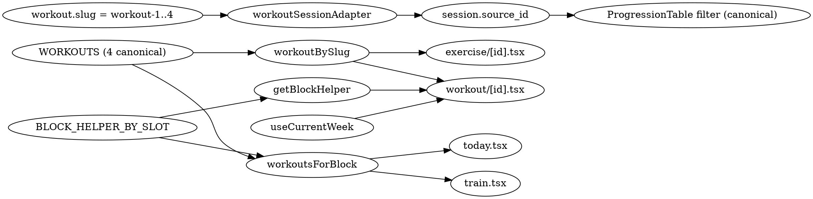

# Collapse the Workout Schedule to 4 Canonical Workouts

**Date:** 2026-06-19
**Status:** Approved approach (B from the brainstorm)
**Owner:** Carlos
**Driver:** Karen reiterated at the June 17 catch-up that the program is "a fixed 4-workout rotation for 12 weeks." The current code authors 24 workout slugs (6 blocks × 4 slots), producing a data model that disagrees with the product. This spec brings the data into alignment before Karen sees the Friday demo.

## Background

[lib/workoutSchedule.ts](../../../lib/workoutSchedule.ts) builds 24 workouts: a `buildSchedule()` loop emits `commit-workout-1`, `commit-workout-2`, ..., `excel-workout-4`. Only `commit-workout-1` is "AUTHORED"; the other 23 fall back to one of 4 templates in [lib/workoutTemplates.ts](../../../lib/workoutTemplates.ts) (`LOWER_BODY` / `UPPER_PUSH` / `UPPER_PULL` / `FULL_BODY`).

Verified: the AUTHORED `commit-workout-1` is **identical** to the `LOWER_BODY` template. The 24-slug schedule was defensive flexibility for block-specific authoring that Karen has now ruled out.

The cost of that lie shows up in [components/workout/ProgressionTable.tsx](../../../components/workout/ProgressionTable.tsx): it filters historical sessions by `source_id` (the slug). A user in week 5 (REFINE) doing Workout 1 sees only their `refine-workout-1` history, not the `commit-workout-1` weeks 1–2 history of the same exercises. That breaks Karen's progressive-overload narrative end-to-end — the user can't see the squat progression across weeks because each block-prefixed slug looks like a different workout to the data layer.

## What changes

### Data model

- Replace 24 slugs with **4 canonical workouts**: `workout-1`, `workout-2`, `workout-3`, `workout-4`. Titles stay "Workout 1" through "Workout 4."
- A `Workout` entity loses `blockId` and `helper`. Block context becomes external, applied at the call site.
- Exercise contents come straight from the templates: `workout-1` = `LOWER_BODY`, `workout-2` = `UPPER_PUSH`, `workout-3` = `UPPER_PULL`, `workout-4` = `FULL_BODY`. No `AUTHORED` override array; the template *is* the authored content.
- `BLOCK_HELPER_BY_SLOT` survives untouched in [lib/workoutTemplates.ts](../../../lib/workoutTemplates.ts) — it's still the source of block-specific framing. It's just consumed differently.

### New module: `lib/blockContext.ts`

A tiny helper that exposes block-specific framing for any (block, slot) pair without entangling it with workout identity:

```ts
export function getBlockHelper(blockId: BlockId, slotIndex: SlotIndex): string;
```

`workoutsForBlock(blockId)` keeps the same signature but is reimplemented to return the 4 canonical workouts with the block-specific helper overlaid as a presentation field. Callers that need the helper (Today, Train) keep working; callers that don't (workout detail, exercise detail) ignore it.

### Active session `source_id`

[lib/workoutSessionAdapter.ts](../../../lib/workoutSessionAdapter.ts) already sets `id: workout.slug`. After the collapse, that's `workout-1` (etc.) naturally — no adapter change needed. The `ProgressionTable` filter by `workoutId` now correctly groups every session of "Workout 1" across all 12 weeks. The bug fixes itself at the data layer.

### Block kicker on the workout detail screen

[app/workout/[id].tsx](../../../app/workout/[id].tsx) currently renders `BLOCK · {workout.blockId}` using the block baked into the slug. After the collapse, `Workout` has no `blockId` — the screen reads `blockId` from `useCurrentWeek()` (which already exposes it) and renders `BLOCK · {currentBlockId}`. This is actually more correct: today the kicker shows whichever block the slug was associated with, even if the user is now in a different block.

### Dev seed

[lib/workoutHistorySeed.ts](../../../lib/workoutHistorySeed.ts) — change `source_id: 'commit-workout-1'` to `source_id: 'workout-1'`. Existing AsyncStorage caches will still contain the old shape; dev users will need a "Start over" or AsyncStorage clear to see the refreshed seed. This is acceptable — the cohort doing this on real devices is John and Carlos.

## Out of scope (explicit)

- **No data migration for hosted Supabase.** There are no production members on the workout schedule. If sessions exist on the hosted DB from dev testing, they'll point at non-existent slugs after the collapse — that's a non-issue because the UI degrades gracefully (`workoutBySlug(slug)` returns `undefined` → "Workout not found" screen, which is fine for dev-test garbage).
- **No change to the curriculum or block progression.** The 6-block, 12-week structure stays. Only the workout schedule changes.
- **No change to `BLOCK_HELPER_BY_SLOT`.** All 24 helper strings remain authored. They just attach at render time.
- **No change to `ProgressionTable`'s filtering semantics.** The bug it had stops manifesting because the data underneath becomes correctly shared across blocks.
- **No restoration of the `AUTHORED` mechanism.** If Karen ever wants block-specific Workout 1 variations later, we'll reintroduce that as a deliberate feature — not preserve dead flexibility now.

## File-by-file

| File | Change |
|---|---|
| [lib/workoutSchedule.ts](../../../lib/workoutSchedule.ts) | Replace `buildSchedule()` + `AUTHORED` with a static 4-entry `WORKOUTS` array. Drop `blockId` and `helper` from `Workout`. `WorkoutSlug` becomes a typed union `'workout-1' \| 'workout-2' \| 'workout-3' \| 'workout-4'`. Reimplement `workoutsForBlock(blockId)` to return the 4 workouts with block-specific helpers overlaid as `BlockContextualWorkout`. Delete `isStubWorkout()` (no longer meaningful). |
| [lib/blockContext.ts](../../../lib/blockContext.ts) | **New.** Exports `getBlockHelper(blockId, slotIndex)`. Imports `BLOCK_HELPER_BY_SLOT` from `workoutTemplates`. Pure lookup. |
| [lib/workoutTemplates.ts](../../../lib/workoutTemplates.ts) | No change. Templates and `BLOCK_HELPER_BY_SLOT` stay. |
| [lib/workoutHistorySeed.ts](../../../lib/workoutHistorySeed.ts) | Change `source_id` from `'commit-workout-1'` to `'workout-1'`. |
| [app/(tabs)/today.tsx](../../../app/(tabs)/today.tsx) | No change — already consumes `workoutsForBlock(blockId)[0]` and reads `.helper`. The contextualized return type keeps both fields available. |
| [app/(tabs)/train.tsx](../../../app/(tabs)/train.tsx) | No change — same call pattern, same fields. |
| [app/workout/[id].tsx](../../../app/workout/[id].tsx) | Replace `workout.blockId` with `blockId` from `useCurrentWeek()`. Replace `workout.helper` with `getBlockHelper(blockId, workout.slotIndex)`. |
| [app/exercise/[id].tsx](../../../app/exercise/[id].tsx) | No change — uses `workoutBySlug(workoutSlug)` and ignores block fields. The slug it receives now is the collapsed shape. |

## Data flow after the collapse



## Verification

- `npm run typecheck` clean. The `WorkoutSlug` narrowing from `string` to a typed union will catch any stale `'commit-workout-1'` references.
- Manual: Train tab → confirm 4 workouts render with the active block's helper text.
- Manual: Today tab → confirm the "Today's Workout" card shows Workout 1 with the active block's helper.
- Manual: Tap into Workout 1 → confirm the detail screen kicker reads the current block (e.g. "BLOCK · COMMIT" in W1, "BLOCK · REFINE" in W3) and helper text matches the block.
- Manual: Start the workout, log a set, complete. Open Train → tap Workout 1 again → tap an exercise → the active-session progression table should now show the just-completed set in the TODAY column.
- Manual: Use the dev week-jumper to advance to W5 (REFINE). Open Train → Workout 1 → tap db-squat → the "Your history" view shows the seed sessions AND any sessions you logged in W1 — proving the cross-block continuity is real.

## Risk

Moderate but contained. Six files. The type narrowing on `WorkoutSlug` is the safety net — anywhere stale slugs leak through, the compiler complains. The largest behavioral change is the workout detail kicker, which is a one-line swap from `workout.blockId` to the current block. No DB schema change; no hooks API change.

## Follow-up

- Audit any analytics events that include the workout slug (none observed in this scan, but worth a grep on `track`, `recordEvent`, etc. when telemetry expands).
- Consider whether the Today and Train surfaces should label workouts with both their slot ("Workout 1") AND a content hint ("Lower Body") for quick scanning. Out of scope here; Karen's naming convention is "Workout 1/2/3/4" only.
- If Karen later wants progressive exercise variation across blocks (e.g. EXCEL Workout 1 swaps in heavier-bias exercises), reintroduce the `AUTHORED` override as a deliberate feature with its own spec.
